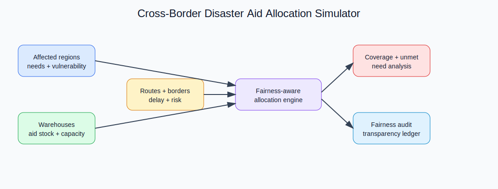
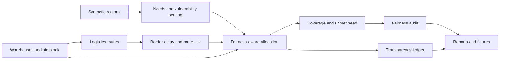

# Cross-Border Disaster Aid Allocation Simulator

<p align="center"><strong>Research-grade humanitarian aid allocation simulator for balancing urgency, vulnerability, logistics, fairness, transparency, and auditability across disaster-affected regions and borders.</strong></p>

<p align="center">
  <a href="../../actions/workflows/python-checks.yml"></a>
  <a href="LICENSE"></a>
  
  
</p>

> **Humanitarian decision boundary:** this repository uses fictional synthetic countries, regions, warehouses, needs, routes, and aid stocks by default. It is research and planning infrastructure only. It must not be used as an official allocation order, route instruction, border-clearance decision, or humanitarian prioritization decision without expert review, field validation, legal review, and coordination with authorized humanitarian actors.

---

## Research objective

Can a fairness-aware disaster aid allocation simulator improve humanitarian resource distribution across borders while balancing urgency, logistics constraints, vulnerability, and transparent decision accountability?

| Research question | Evidence generated locally |
| --- | --- |
| Which regions have the most urgent and vulnerable unmet needs? | Need table, urgency scores, unmet-need report |
| How much do logistics and border delays affect aid access? | Route-delay table and logistics figure |
| Does fairness-aware allocation reduce regional neglect? | Coverage-gap and neglect-risk audit |
| Which aid types should be allocated first? | Allocation plan by aid type, region, warehouse |
| Can decisions remain transparent? | Decision trace and hash-chained audit ledger |
| Can policies be compared safely? | Baseline vs fairness-aware allocation metrics |

---

## Architecture

<p align="center"></p>



The diagram is conceptual. All metrics and figures are generated by the local synthetic lab.

---

## Run today — no real disaster dataset needed

```bash
python scripts/run_synthetic_aid_lab.py
```

Windows quick start:

```bat
cd %USERPROFILE%\cross-border-disaster-aid-allocation-simulator
git pull

py -m venv .venv
.venv\Scripts\activate

python -m pip install --upgrade pip
python -m pip install -r requirements.txt
python scripts/run_synthetic_aid_lab.py
```

Optional controls:

```bash
python scripts/run_synthetic_aid_lab.py --regions 28 --warehouses 5 --seed 42
```

---

## Generated local outputs

```text
outputs/results/synthetic_regions.csv
outputs/results/synthetic_warehouses.csv
outputs/results/synthetic_aid_inventory.csv
outputs/results/synthetic_routes.csv
outputs/results/synthetic_needs.csv
outputs/results/synthetic_allocation_plan.csv
outputs/results/synthetic_unmet_need.csv
outputs/results/synthetic_fairness_audit.csv
outputs/results/synthetic_logistics_summary.csv
outputs/results/synthetic_policy_comparison.csv
outputs/results/synthetic_aid_summary.json
outputs/reports/synthetic_aid_report.md
outputs/audit/allocation_audit_log.jsonl

outputs/figures/synthetic_need_urgency.png
outputs/figures/synthetic_allocation_coverage.png
outputs/figures/synthetic_fairness_gaps.png
outputs/figures/synthetic_logistics_delay.png
outputs/figures/synthetic_aid_type_coverage.png
```

Every output is synthetic and local.

---

## Synthetic humanitarian setting

| Entity | Examples | Research role |
| --- | --- | --- |
| Countries | Northland, Eastoria, Southport | Cross-border coverage audit |
| Regions | District-level fictional affected areas | Needs and vulnerability scoring |
| Warehouses | Border hubs and inland depots | Stock and routing constraints |
| Border crossings | Low/medium/high friction routes | Delay and access simulation |
| Aid types | food, water, medical, shelter, hygiene, fuel, generators, mobile clinics | Allocation categories |
| Humanitarian actors | fictional coordination partners | Transparency metadata only |

---

## Aid allocation logic

The lab compares two allocation policies:

| Policy | Description | Use |
| --- | --- | --- |
| `urgency_first` | Prioritizes high urgency and vulnerability, then logistics | Baseline humanitarian triage policy |
| `fairness_aware` | Adds country coverage gap, minimum service guarantee, and neglect-risk penalties | Research policy for balancing need and fairness |

The allocation score is a transparent weighted signal:

```text
priority = need_severity + vulnerability + urgency + logistics_access + fairness_boost
```

It is a planning score, not a real-world moral ranking.

---

## Fairness and transparency metrics

| Metric | Meaning | Boundary |
| --- | --- | --- |
| Need coverage | Delivered quantity divided by requested quantity | Synthetic need units only |
| Vulnerability-weighted coverage | Coverage adjusted by population vulnerability | Research proxy |
| Country coverage gap | Difference between best and worst country coverage | Synthetic fairness signal |
| Minimum service violation | Region below minimum coverage target | Requires human review |
| Neglect risk | High need and low coverage after allocation | Planning warning |
| Allocation disparity index | Spread of coverage across regions | Audit signal |
| Decision trace coverage | Allocation rows with rationale fields | Transparency measure |

---

## Logistics model

Routes include:

- distance;
- road damage;
- route risk;
- border friction;
- customs delay;
- warehouse handling capacity;
- aid-type handling difficulty.

The route model is synthetic and simplified. It is not a navigation system or border-clearance prediction tool.

---

## Repository map

```text
.
├── assets/                         Conceptual architecture and workflow diagrams
├── configs/                        Synthetic lab configuration
├── data/                           Dataset boundary and future adapter notes
├── docs/                           Methodology, synthetic lab, ethics policy, report template
├── matlab/                         MATLAB plotting script
├── notebooks/                      Synthetic aid allocation walkthrough
├── outputs/                        Local-only generated results, figures, reports, audit logs
├── scripts/                        One-command synthetic lab runner
├── src/aidalloc/
│   ├── synthetic.py                Fictional regions, warehouses, routes, inventory, needs
│   ├── scoring.py                  Need, urgency, vulnerability, and fairness scores
│   ├── logistics.py                Route and border-delay simulation
│   ├── optimizer.py                Baseline and fairness-aware allocation policies
│   ├── fairness.py                 Coverage, disparity, and neglect-risk audits
│   ├── visualization.py            Generated figures
│   ├── reporting.py                Markdown report generation
│   ├── audit.py                    Hash-chained transparency ledger
│   └── config.py                   Seeds and output folders
└── tests/                          Synthetic generation, allocation, fairness, audit, pipeline tests
```

---

## Documentation

- [`docs/methodology.md`](docs/methodology.md): allocation model, fairness metrics, logistics model, and limitations.
- [`docs/synthetic_lab.md`](docs/synthetic_lab.md): commands, outputs, and interpretation rules.
- [`docs/humanitarian_ethics_policy.md`](docs/humanitarian_ethics_policy.md): decision boundary and deployment safeguards.
- [`docs/report_template.md`](docs/report_template.md): evidence-only report skeleton.
- [`data/README.md`](data/README.md): real data boundary and adapter fields.

---

## MATLAB workflow

After running the Python lab:

```matlab
addpath('matlab')
plot_aid_metrics('outputs')
```

The MATLAB script reads generated CSV outputs and saves an additional local comparison figure.

---

## Reproducibility

- Fixed seed controls synthetic regions, stock, needs, and routes.
- Deterministic baseline and fairness-aware allocation policies.
- Local CSV, JSON, Markdown, figure, and audit outputs.
- Hash-chained audit log for transparency traceability.
- GitHub Actions runs the data-free test suite.

Run tests:

```bash
python -m pytest
```

---

## Future extensions

| Extension | Requirement before claiming results |
| --- | --- |
| Real humanitarian needs data | Authorization, privacy review, data provenance, and humanitarian partner validation |
| GIS map integration | Coordinate validation and non-sensitive geography boundary |
| Optimization solver comparison | Documented objective functions and execution logs |
| Multi-period allocation | Time-step assumptions and stock replenishment rules |
| Stakeholder preference modelling | Governance review and bias assessment |
| Live deployment | Formal safety, legal, humanitarian, and operational review |

---

## Limitations

1. Synthetic data does not represent real crises, countries, borders, or communities.
2. The allocation score is a research proxy, not an official humanitarian priority rule.
3. Fairness metrics are audit signals, not moral or legal conclusions.
4. Route delays and border friction are simplified simulations.
5. Real humanitarian deployment requires expert review, field validation, local context, coordination, consent, privacy controls, and accountable governance.

## License

Released under the [MIT License](LICENSE). Real disaster and humanitarian datasets are not included.
